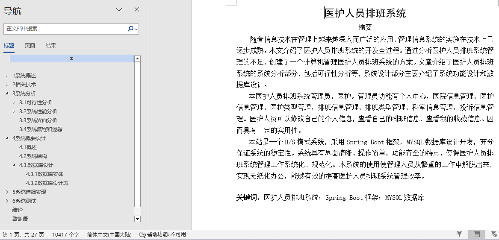
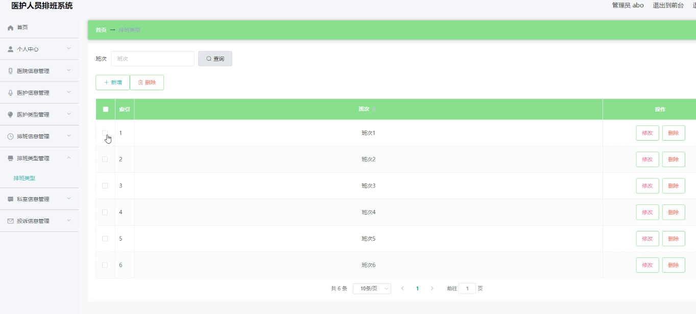
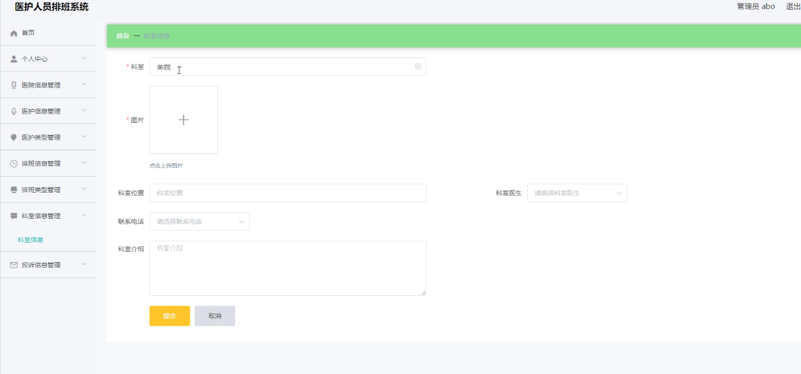
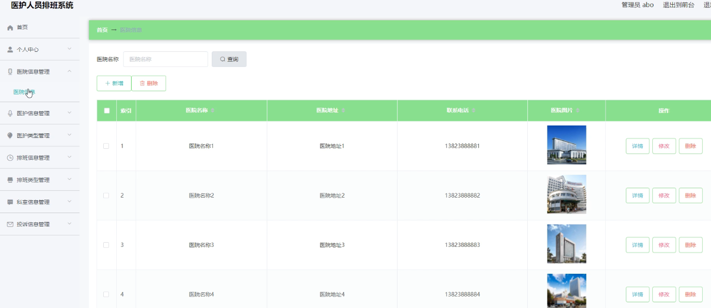
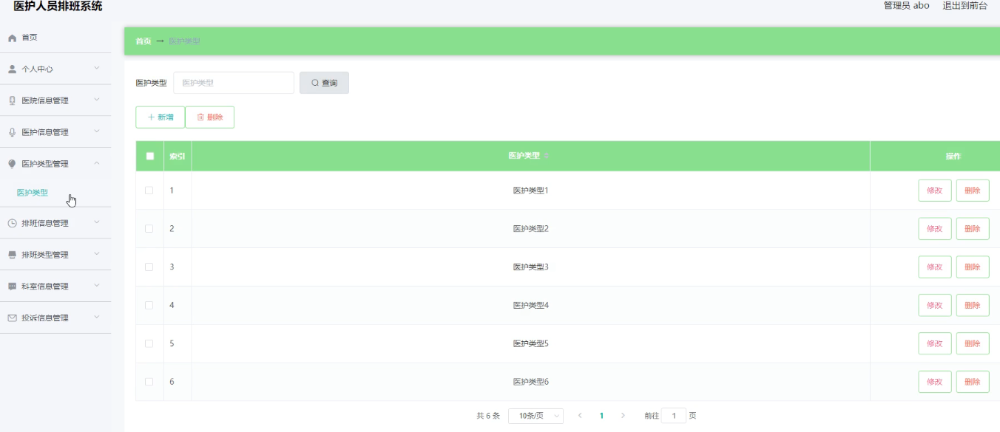

## 基于springboot的医护人员排班系统(程序+报告)

###  获取sql数据库文件: 从戎源码网 (https://armycodes.com/) QQ: 386869957 QQ群: 377586148
###  所有系统地址: (https://github.com/YuLin-Coder/AllProjectCatalog) 
###  所有项目以及源代码本人均调试运行无问题 可支持远程安装部署调试、定制修改、代码讲解

## 项目介绍
基于springboot的医护人员排班系统，系统包含两种角色：用户、管理员，系统主要功能如下：

医护类型管理：管理员可以添加、修改、删除医护类型，确保系统能够区分不同类型的医护人员。

排班类型管理：允许管理员定义不同的排班类型，包括添加新类型、修改类型属性以及删除不再需要的类型。

科室信息管理：提供对科室信息的添加、修改和删除功能，以维护准确的科室信息记录。

医院信息管理：管理员可以管理医院的基本信息，包括名称、地址和联系方式，确保信息始终保持最新和准确。

医护信息管理：允许管理员添加、修改和删除医护人员的详细信息，包括姓名、职称和联系方式等。

## 项目技术
- 编程语言：Java
- 数据库：MySQL
- 项目管理工具：Maven
- 前端技术：HTML、CSS、JavaScript、Jquery、Vue
- 后端技术：Spring、SpringMVC、MyBatis

## 运行环境
- JDK版本：JDK1.8及以上
- 开发工具：IDEA、Ecplise、Myecplise都可以
- 数据库: MySQL5.7及以上
- Maven：maven3.0及以上
- Node：14.14.0及以上

## 运行截图

